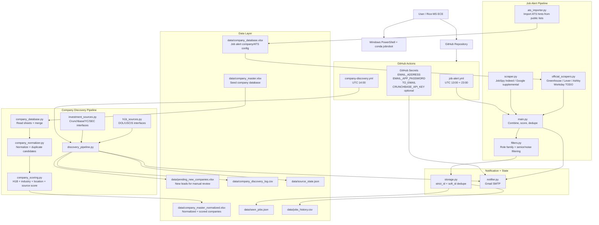
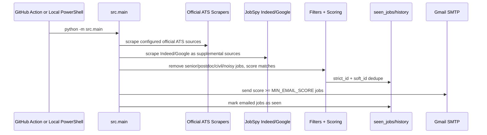
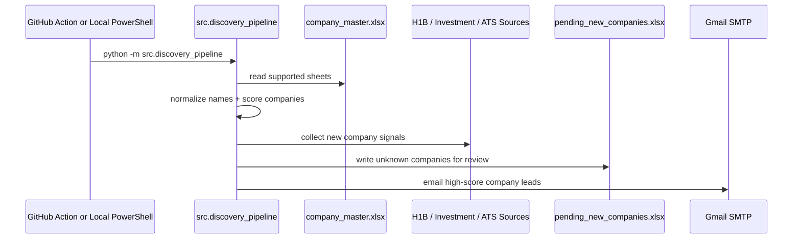

# EE / Semiconductor New Grad Job Alert

This project monitors Electrical Engineering, Hardware, Semiconductor, Process, Validation, Embedded, Firmware, Controls, and Manufacturing new grad or entry level jobs. It runs locally on Windows or on GitHub Actions, stores already-seen jobs, and sends new matches by Gmail SMTP.

It does not auto-apply to jobs. It only monitors and alerts.

## What This System Does

JobRobot has two connected workflows:

1. **Job Alert**: finds EE/ECE/Semiconductor new grad or entry-level jobs and sends email alerts.
2. **Company Discovery**: maintains and improves a target company database, scores companies, and keeps new leads in a pending review file.

The intended daily workflow is:

```text
Check job alert email -> apply to strong matches
Review pending companies weekly -> approve good companies into company_master.xlsx
Improve ATS/H-1B/enrichment coverage over time
```

## System Architecture



## Runtime Flow

### Job Alert Flow



### Company Discovery Flow



## Project Structure

```text
jobrobot/
├── .github/workflows/job-alert.yml
├── data/
│   ├── company_master.xlsx
│   ├── company_master_normalized.xlsx
│   ├── pending_new_companies.xlsx
│   ├── company_discovery_log.csv
│   ├── source_state.json
│   ├── seen_jobs.json
│   ├── jobs_history.csv
│   └── company_database.xlsx
├── src/
│   ├── __init__.py
│   ├── ats_importer.py
│   ├── ats_sources.py
│   ├── company_database.py
│   ├── company_normalizer.py
│   ├── company_scoring.py
│   ├── config.py
│   ├── discovery_pipeline.py
│   ├── h1b_sources.py
│   ├── investment_sources.py
│   ├── job_sources.py
│   ├── official_scrapers.py
│   ├── scraper.py
│   ├── filters.py
│   ├── storage.py
│   ├── notifier.py
│   └── main.py
├── tests/
│   ├── test_filters.py
│   └── test_storage.py
├── requirements.txt
├── README.md
└── .gitignore
```

## Windows Local Setup

Open PowerShell from `C:\finalproject\jobrobot`.

```powershell
conda create -n jobrobot python=3.11 -y
conda activate jobrobot
python -m pip install --upgrade pip
pip install -r requirements.txt
```

Quick dependency check:

```powershell
python -c "from jobspy import scrape_jobs; print('JobSpy installed successfully')"
```

## Quick Start

Run tests:

```powershell
cd C:\finalproject\jobrobot
conda activate jobrobot
python -m pytest
```

Run job alerts:

```powershell
python -m src.main
```

Run company discovery:

```powershell
python -m src.discovery_pipeline
```

Import public ATS hints:

```powershell
python -m src.ats_importer --dry-run
python -m src.ats_importer
```

Open generated files:

```text
data/company_master_normalized.xlsx
data/pending_new_companies.xlsx
data/jobs_history.csv
```

## Gmail App Password

Use a Gmail App Password, not your normal Gmail password.

1. Enable 2-Step Verification in your Google account.
2. Open Google Account security settings.
3. Create an App Password for Mail.
4. Save it as an environment variable.

For local PowerShell:

```powershell
$env:EMAIL_ADDRESS="your_email@gmail.com"
$env:EMAIL_APP_PASSWORD="your_16_character_app_password"
$env:TO_EMAIL="destination_email@gmail.com"
```

For persistent Windows user variables:

```powershell
setx EMAIL_ADDRESS "your_email@gmail.com"
setx EMAIL_APP_PASSWORD "your_16_character_app_password"
setx TO_EMAIL "destination_email@gmail.com"
```

Restart PowerShell after `setx`.

## Run Locally

```powershell
conda activate jobrobot
cd C:\finalproject\jobrobot
python -m src.main
```

The script will:

1. Create missing data files.
2. Read active companies from `data/company_database.xlsx`.
3. Search configured official ATS sources first.
4. Search Indeed and Google through `python-jobspy` as supplemental sources.
5. Filter and score jobs.
6. Skip jobs already stored in `data/seen_jobs.json`.
7. Append emailed jobs to `data/jobs_history.csv`.
8. Send an email only when new jobs are found.

## Company Discovery Pipeline

Put your seed company workbook here:

```text
data/company_master.xlsx
```

The pipeline reads these sheets when present:

```text
Master_Company_List
Company_DB
Apply_Now
Texas_Targets
Strong_H1B
Cold_Targets
```

Run company discovery locally:

```powershell
conda activate jobrobot
cd C:\finalproject\jobrobot
python -m src.discovery_pipeline
```

Outputs:

```text
data/company_master_normalized.xlsx
data/pending_new_companies.xlsx
data/company_discovery_log.csv
data/source_state.json
```

`company_master_normalized.xlsx` contains:

```text
normalized_companies
duplicate_candidates
```

New companies are written to `pending_new_companies.xlsx` by default. They are not merged into the master file unless:

```powershell
$env:AUTO_MERGE_NEW_COMPANIES="true"
```

The default is false.

## Reviewing Pending Companies

Open:

```text
data/pending_new_companies.xlsx
```

Review:

```text
overall_company_score
Recommended Action
H1B Sponsor Signal
Industry Focus
Major Locations
Official Careers URL
Source
Discovery Reason
```

To merge a company manually, copy the approved row into `data/company_master.xlsx`, preferably into `Master_Company_List`, then run:

```powershell
python -m src.discovery_pipeline
```

This regenerates normalized output and duplicate candidates.

## H-1B Sponsor Signal

H-1B sponsor signal is evidence, not a guarantee. A company may have historical LCA or USCIS records and still not sponsor a specific new grad role.

Signals:

```text
High: multiple recent relevant LCA/H-1B records
Medium: some records or moderate relevance
Low: very few records or weak role relevance
Unknown: no evidence loaded
```

Official source interfaces:

- DOL OFLC disclosure files
- USCIS H-1B Employer Data Hub

The code prioritizes official public data and can summarize a local DOL disclosure CSV/XLSX if you provide one to `src.h1b_sources.discover_h1b_companies()`.

## Investment and New Company Sources

The discovery pipeline includes safe stubs for:

- Crunchbase API, enabled only when `CRUNCHBASE_API_KEY` exists
- YC public company discovery, TODO
- SEC EDGAR company enrichment, TODO

If `CRUNCHBASE_API_KEY` is missing, the pipeline skips Crunchbase and does not fail.

## Company Database

The company database lives at:

```text
data/company_database.xlsx
```

The main sheet is:

```text
Company_DB
```

Required columns:

```text
Company Name
Priority
Category
Industry Focus
Target Role Family
Target Keywords
Major Locations
Career Site URL
Monitoring Status
Application Status
Sponsorship Fit
Notes
ATS Type
ATS Company Slug
Official Careers URL
Official Job Search URL
Use Official Scraper
Last Checked At
Last Official Job Count
```

Only companies where `Monitoring Status` is not `Paused` are used. `Company Name` helps company matching, `Target Keywords` expands search terms, and `Major Locations` expands search locations.

If the Excel file is missing, the app creates a template with default semiconductor, EE, hardware, automation, and medical device companies.

## Official ATS Sources

Official sources are preferred over job boards. To enable one company, edit `data/company_database.xlsx` on the `Company_DB` sheet:

```text
ATS Type: greenhouse, lever, ashby, or workday
ATS Company Slug: company slug used by the ATS
Use Official Scraper: Yes
Official Careers URL: public company careers page
Official Job Search URL: optional direct job search URL
```

Supported now:

- Greenhouse: `https://boards-api.greenhouse.io/v1/boards/{slug}/jobs`
- Lever: `https://api.lever.co/v0/postings/{slug}`
- Ashby: `https://api.ashbyhq.com/posting-api/job-board/{slug}`

Workday has a placeholder interface because each company tenant can use a different API path and payload. Add company-specific Workday parsing only after confirming the exact URL.

Every job is normalized to:

```text
title
company
location
source
job_url
description
search_term
source_type
```

`source_type` values include `official_greenhouse`, `official_lever`, `official_ashby`, `official_workday`, `jobspy_indeed`, `jobspy_google`, and `jobspy_linkedin`.

## Import ATS Settings

You can import ATS settings from public SimplifyJobs lists. The importer reads application links, detects Greenhouse / Lever / Ashby / Workday URLs, and writes the matching ATS fields into `data/company_database.xlsx`.

Dry run first:

```powershell
conda activate jobrobot
cd C:\finalproject\jobrobot
python -m src.ats_importer --dry-run
```

Update only companies already present in your Excel database:

```powershell
python -m src.ats_importer
```

Also add companies not already in your Excel database:

```powershell
python -m src.ats_importer --add-missing
```

Import only new-grad or internship sources:

```powershell
python -m src.ats_importer --source new-grad
python -m src.ats_importer --source internships
```

For a small test run:

```powershell
python -m src.ats_importer --dry-run --limit 20
```

The importer fills:

```text
ATS Type
ATS Company Slug
Official Careers URL
Official Job Search URL
Use Official Scraper
Last Checked At
Notes
```

Then run the normal alert:

```powershell
python -m src.main
```

## Adjust Keywords and Locations

Edit [src/config.py](src/config.py):

- `DEFAULT_SEARCH_TERMS`
- `DEFAULT_LOCATIONS`
- `POSITIVE_KEYWORDS`
- `NEGATIVE_KEYWORDS`
- `ENABLE_LINKEDIN`
- `MAX_SEARCH_TERMS`
- `MAX_LOCATIONS`

LinkedIn is off by default because it is less stable for scraping.

By default, the app caps the run to the first 16 search terms and first 11 locations so a local test does not create hundreds of scraping requests. To temporarily expand a run in PowerShell:

```powershell
$env:MAX_SEARCH_TERMS="25"
$env:MAX_LOCATIONS="20"
python -m src.main
```

Email alerts only include jobs with `score >= 6`, capped to 25 jobs by default:

```powershell
$env:MIN_EMAIL_SCORE="7"
$env:MAX_EMAIL_JOBS="15"
python -m src.main
```

The scoring favors official sources, then Google, then Indeed/LinkedIn. It strongly penalizes senior, staff, principal, manager, director, Engineer III/IV, postdoc, PhD-required, civil, highway, structural, forensic, and Korean-bilingual-only roles.

## GitHub Actions Setup

Create a GitHub repository, then add these repository secrets:

```text
EMAIL_ADDRESS
EMAIL_APP_PASSWORD
TO_EMAIL
CRUNCHBASE_API_KEY
```

`CRUNCHBASE_API_KEY` is optional.

The workflow runs at UTC 13:00 and UTC 23:00, and can also be started manually from the Actions tab.

The company discovery workflow runs daily at UTC 14:00 and can also be started manually.

It commits changes to:

```text
data/seen_jobs.json
data/jobs_history.csv
data/company_database.xlsx
data/company_master_normalized.xlsx
data/pending_new_companies.xlsx
data/company_discovery_log.csv
data/source_state.json
```

## Run Tests

```powershell
conda activate jobrobot
cd C:\finalproject\jobrobot
pytest
```

or:

```powershell
python -m pytest
```

## Thresholds

Adjust thresholds with environment variables:

```powershell
$env:MIN_EMAIL_SCORE="6"
$env:MAX_EMAIL_JOBS="25"
$env:MIN_COMPANY_EMAIL_SCORE="50"
$env:MAX_COMPANY_EMAILS="25"
```

## Adding ATS Slugs

For each company in `data/company_master.xlsx`, fill:

```text
ATS Type: greenhouse / lever / ashby / workday
ATS Company Slug
Official Careers URL
Official Job Search URL
Use Official Scraper
```

Workday, SmartRecruiters, and iCIMS are intentionally not hard-coded yet because they vary by tenant. Add them as explicit per-company integrations once the public endpoint is confirmed.

## Push to GitHub

```powershell
cd C:\finalproject\jobrobot
git init
git add .
git commit -m "Initial EE semiconductor job alert"
git branch -M main
git remote add origin https://github.com/YOUR_USERNAME/YOUR_REPO.git
git push -u origin main
```

If the repository already exists locally, skip `git init` and `git remote add origin`.

## Troubleshooting

### Python 3.13 install or numpy failures

Use Python 3.11. Some scraping and data dependencies can lag behind the newest Python release.

```powershell
conda create -n jobrobot python=3.11 -y
```

### CondaVerificationError

Clean conda caches and recreate the environment.

```powershell
conda clean --all -y
conda create -n jobrobot python=3.11 -y
```

### Gmail SMTP authentication failed

Use a Gmail App Password. Do not use your normal Gmail password. Confirm all three variables are set:

```powershell
echo $env:EMAIL_ADDRESS
echo $env:EMAIL_APP_PASSWORD
echo $env:TO_EMAIL
```

### JobSpy returns no jobs

Try a broader location such as `United States`, reduce strict keywords, or wait and rerun. Job boards can throttle or return different results by region.

### GitHub Actions cannot commit

Check that the workflow has:

```yaml
permissions:
  contents: write
```

Also confirm the repository setting allows GitHub Actions to read and write repository contents.

## GitHub Deployment Checklist

1. Push code to GitHub.
2. Add repository secrets:

```text
EMAIL_ADDRESS
EMAIL_APP_PASSWORD
TO_EMAIL
CRUNCHBASE_API_KEY
```

`CRUNCHBASE_API_KEY` is optional.

3. Enable write permission:

```text
Settings -> Actions -> General -> Workflow permissions -> Read and write permissions
```

4. Run workflows manually once:

```text
Actions -> EE Job Alert -> Run workflow
Actions -> EE Company Discovery -> Run workflow
```

5. Confirm updated files are committed by GitHub Actions:

```text
data/seen_jobs.json
data/jobs_history.csv
data/company_master_normalized.xlsx
data/pending_new_companies.xlsx
data/company_discovery_log.csv
data/source_state.json
```

## Manual Review Workflow

Weekly:

1. Open `data/pending_new_companies.xlsx`.
2. Sort by `overall_company_score` descending.
3. Review `Recommended Action`, `H1B Sponsor Signal`, `Industry Focus`, `Major Locations`, and `Official Careers URL`.
4. Copy approved companies into `data/company_master.xlsx`.
5. Run:

```powershell
python -m src.discovery_pipeline
```

Daily:

1. Read the Job Alert email.
2. Prioritize `[OFFICIAL]` jobs.
3. Apply to high-score roles.
4. Let `seen_jobs.json` prevent repeat alerts.
